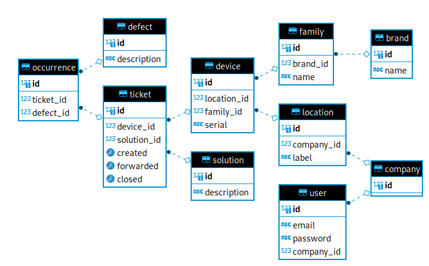

# SELFSOLVER

Selfsolver project provides a platform for support self-service.

## How to install

Requires `poetry` and `python>=3.8`.

Run `poetry install` to install dependencies.
Copy the `.env.example` to `.env` for development environments.
Use `poetry run flask generate-secret` to generate entropic enough secrets. (see `.env.example`)
Finally, run `poetry run flask run` to run the app.

## How to run tests

Run `poetry run pytest --cov` to run all the tests and see a basic coverage report.
Make sure the `TEST_DATABASE_URL` environment variable is set correctly.

## How to set up the database

Run `poetry run flask database setup`.
After any changes to the models, you may need to recreate the tables.
Run `poetry run flask database reset`. _THIS WILL DESTROY ALL APP DATA_.

## How to create companies

There's no http api to create companies (by design).
Run `poetry run flask company create` to create a company.
The id will be mentioned in the command output.

## How to create users

There's no http api for signup (by design).
Run `poetry run flask user create {COMPANY_ID} {EMAIL} {PASSWORD}` to create a user with those credentials.
E.g. `poetry run flask user create 1 email@example.com correct-horse-battery-staple`.

## How to seed more data

Run `poetry run flask seed` to create user, company, devices, models, brands, defects and locations.
Run `poetry run flask seed {COMPANY_ID}` if you want to tie this data to a specific company.

## REST API

This project exposes a (mostly) RESTful API. Request and response contents are expected to be JSON. Authentication through JWT should go in the `Authorization` header, under the bearer token scheme. Authentication is required except where indicated.

The implemented endpoints are documented below:

### POST /login

Requires credentials:

- `email`: the user email.
- `password`: the user password.

Responds with 400 if data is missing (or not json).
Responds with 401 if credentials don't match any user.
Responds with 200, JWT available under `access_token` property.

### GET /tickets

Responds 200 with an array of tickets and related data.

```
[
  {
    "closed": null,
    "created": "2020-11-12T21:48:01.132227",
    "device": {
      "family": {
        "brand": {
          "id": 1,
          "name": "Valdez, Wilson and Montgomery"
        },
        "brand_id": 1,
        "id": 1,
        "name": "DarkGreen"
      },
      "family_id": 1,
      "id": 1,
      "location": {
        "company_id": 1,
        "id": 1,
        "label": "Vazquezfurt"
      },
      "location_id": 1,
      "serial": "2927009444124"
    },
    "device_id": 1,
    "forwarded": null,
    "id": 1,
    "solution_id": null
  },
  { ... },
  ...
]
```

### GET /devices

Responds with an array of device objects with related data (not normalized).

```
[
  {
    "family": {
      "brand": {
        "id": 1,
        "name": "Valdez, Wilson and Montgomery"
      },
      "brand_id": 1,
      "id": 1,
      "name": "DarkGreen"
    },
    "family_id": 1,
    "id": 1,
    "location": {
      "company_id": 1,
      "id": 1,
      "label": "Vazquezfurt"
    },
    "location_id": 1,
    "serial": "2927009444124"
  },
  { ... },
  ...
]
```

### GET /defects

Responds with an array of defect objects.

```
[
  {
    "description": "O aparelho n\u00e3o liga.",
    "id": 1
  },
  { ... },
  ...
]
```

### POST /tickets

Requires new ticket data:

- `defect`: defect id (int) for defects in this ticket.
- `device`: device id (int) for the device this ticket is about.

Responds with 400 if data is missing (or not json).
Responds with 404 if either defect or device are not found in database.
Responds with 403 if device is not allocated to user's company.
Responds with 200 and the new ticket data and related data (not normalized).

```
{
  "closed": null,
  "created": "2020-11-22T21:53:12.766012",
  "device": {
    "family": {
      "brand": {
        "id": 2,
        "name": "Thompson, Turner and Love"
      },
      "brand_id": 2,
      "id": 2,
      "name": "Ivory"
    },
    "family_id": 2,
    "id": 2,
    "location": {
      "company_id": 1,
      "id": 2,
      "label": "Meganmouth"
    },
    "location_id": 2,
    "serial": "0279271851103"
  },
  "device_id": 2,
  "forwarded": null,
  "id": 15,
  "solution_id": null
}
```

### GET /tickets/{ticket_id}/solutions

Responds with an array of possible solutions for ticket. Solution description is **NON-SANITIZED** markdown.

```
[
  {
    "description": "\nPrimeiro, confira se a **tomada** est\u00e1 ligada.\n\n\nAl\u00e9m disso, confira tamb\u00e9m:\n\n* o cabo\n* a tomada\n* a energia da casa\n",
    "id": 1
  },
  {
    "description": "\n* Remova os atolamentos e elimine o erro para continuar imprimindo.\n* Verifique a bandeja de entrada, bandeja de sa\u00edda, \u00e1rea de acesso ao cartucho de tinta e parte de baixo da impressora, e remova todo papel atolado.\n* Remova todo o papel da bandeja de entrada.\n\nhttps://www.youtube.com/watch?v=9Y-HYkMggwg\n",
    "id": 5
  },
  { ... },
  ...
]
```

### PUT /tickets/{ticket_id}

Requires closing ticket info. One of the following is required:

- solution: id of the solution that closed the ticket.
- forwarded: true if the ticket was forwarded to support team.

Responds with 400 if data is missing (or not json).
Responds with 404 if either `ticket_id` or `solution` is not in database.
Responds with 403 if ticket was not attached to device allocated to current user's company.
Responds with 200 and the updated ticket and related data (not normalized).

```
{
  "closed": "2020-11-22T19:04:45.206516",
  "created": "2020-11-12T21:48:01.132227",
  "device": {
    "family": {
      "brand": {
        "id": 1,
        "name": "Valdez, Wilson and Montgomery"
      },
      "brand_id": 1,
      "id": 1,
      "name": "DarkGreen"
    },
    "family_id": 1,
    "id": 1,
    "location": {
      "company_id": 1,
      "id": 1,
      "label": "Vazquezfurt"
    },
    "location_id": 1,
    "serial": "2927009444124"
  },
  "device_id": 1,
  "forwarded": null,
  "id": 1,
  "solution_id": 1
}
```

## Entity Relationship Diagram



## How to deploy to Heroku

Requires [heroku command line][heroku-cli].

```bash
# First, login to heroku.
$ heroku login

# Proceed to create an app
$ heroku create

# Set up a poetry-enabled buildpack
$ heroku buildpacks:add https://github.com/moneymeets/python-poetry-buildpack.git
$ heroku buildpacks:add heroku/python

# Enable the postgresql addon
$ heroku addons:create heroku-postgresql:hobby-dev

# Set buildpack-specific environment variables
$ heroku config:set POETRY_VERSION=1.0.10
$ heroku config:set DISABLE_POETRY_CREATE_RUNTIME_FILE=1

# Set app-specific environment variables
$ heroku config:set FLASK_APP=selfsolver/app.py
$ heroku config:set JWT_SECRET_KEY=`poetry run flask generate-secret`
$ heroku config:set PASSWORD_PEPPER=`poetry run flask generate-secret`

# Deploy to heroku using git
$ git push heroku main

# Don't forget to setup database once the app is running
$ heroku run flask database setup
```

[heroku-cli]: https://devcenter.heroku.com/articles/heroku-cli#download-and-install
